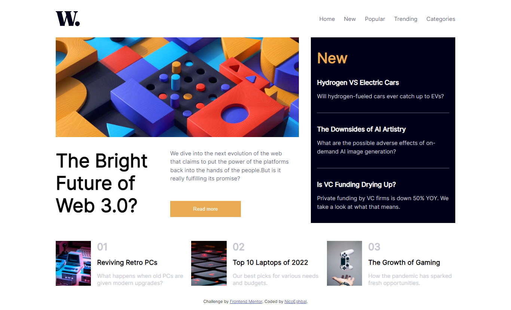

# Frontend Mentor - News homepage solution

This is a solution to the [News homepage challenge on Frontend Mentor](https://www.frontendmentor.io/challenges/news-homepage-H6SWTa1MFl). Frontend Mentor challenges help you improve your coding skills by building realistic projects. 

## Table of contents

- [Overview](#overview)
  - [The challenge](#the-challenge)
  - [Screenshot](#screenshot)
  <!-- - [Links](#links) -->
- [My process](#my-process)
  - [Built with](#built-with)
  - [What I learned](#what-i-learned)
- [Author](#author)

**Note: Delete this note and update the table of contents based on what sections you keep.**

## Overview

### The challenge

Users should be able to:

- View the optimal layout for the interface depending on their device's screen size
- See hover and focus states for all interactive elements on the page

### Screenshot

<!-- ### Links

- Live Site URL: [Add live site URL here](https://your-live-site-url.com) -->

## My process

### Built with

- Semantic HTML5 markup
- CSS 
- Flexbox
- CSS Grid
- Js

### What I learned

I have professionally mastered layout design with CSS Grid and it has given me a good challenge in being responsive.

## Author

- github - [NicoEghbal](https://github.com/NicoEghbal/)
- Frontend Mentor - [@NicoEghbal](https://www.frontendmentor.io/profile/yourusername)
